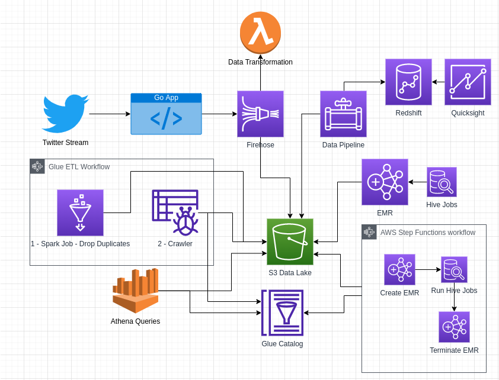
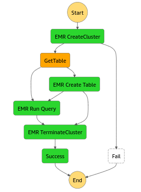

# AWS Twitter Data Analytics

Project to Learn Data Analytics in AWS using twitter data.

## Important Notes

* This project/code isn't optimized for Production.
* Some Architecting decisions doesn't make sense in production only in learning context.
* The configurations aren't cost optimized due learning reasons.
* This architecture doesn't follow the security best practices.
* Most of the AWS services used in this project don't have free tier. Deploy this, will have costs.

## About The Project



The main goal for this project is learning/test/play Data Analytics in AWS using data from twitter.

### Built With

**Data Source**

[Twitter](https://twitter.com/)

**Deployment**

* [Terraform](https://www.terraform.io/)

**Programming**

* [GO](https://go.dev/)
* [Python](https://www.python.org/)
* [PySpark](https://spark.apache.org/docs/latest/api/python/)
* [Hive](https://hive.apache.org/)
* [GNUMakeFile](https://www.gnu.org/software/make/manual/make.html)

**AWS Services**

* [S3](https://aws.amazon.com/s3/)
* [Lambda](https://aws.amazon.com/lambda/)
* [Kinesis Firehose](https://aws.amazon.com/kinesis/data-firehose/)
* [GLUE - Catalog, Crawler, Job, Workflow](https://aws.amazon.com/glue/)
* [Elastic Map Reduce](https://aws.amazon.com/emr/)
* [Step Functions](https://aws.amazon.com/step-functions/)

### Components:

**Data Collection**

Data collection consist in application written in go app listen twitter stream for tweets.
The go app configure the twitter stream to receive only tweets related with nba.
The app sends the tweets to Kinesis Firehose. 
Kinesis Firehose will store the tweets in S3 after runs a lambda to transform the twitter record. 
Firehose also store in S3 the original records.

**Glue ETL**

The GLUE ETL consists in two steps. One Glue Job that runs a python spark script to remove duplicated tweets and a glue crawler to read the tweets records in s3 and create the table in glue data catalog.
This project has a glue workflow to run these two steps. First remove duplicates and then runs the crawler.

**EMR Cluster**

An EMR Cluster is created to do some tests. The EMR Cluster is created with Hive and configured to Hive use the data catalog.

**Step Functions**



The state machine creates EMR Cluster to run hive scripts. The hive script result is stored in S3 via a created external table.

## Getting Started

### Deploy

***Pre Requisites***

* AWS Cli Configured
* Terraform
* EC2 Key Pair Created to deploy EMR Cluster
* VPC Created at least with one Subnet
* Twitter Keys

```bash
make deploy
```

### Data Collection

**Pre Requisites**

* Golang Installed
* Copy .env.example to .env and add your variables values
  * When the app runs locally, you need have AWS PROFILE configure in your aws credentials file with permissions to assume a role with the necessary permissions to send records to Kinesis firehose
  
You can disable the data collection components changing terraform variable `enable_data_collection` to false.

Execute the following command to run go app:

```shell
make run-collection
```

## Glue ETL

**Pre Requisites:** 

* AWS Cli Configured

You can disable the data glue components changing terraform variable `enable_glue_etl` to false.

Execute the following command to Run Glue Job to Drop duplicates

```shell
make run-drop-duplicates
```

Execute the following command Run Crawler

```shell
make run-crawler
```

Execute the following command to Run Glue Workflow

```shell
make run-glue-workflow
```

## EMR Cluster

You can disable the emr cluster creation by changing terraform variable `enable_emr_cluster` to false.

To do ssh to emr cluster run the following command:

```shell
make EMR_KEY=<key_location> ssh-emr
```

## Step Functions

You can disable the step function creation by changing terraform variable `enable_step_functions` to false.

To run the state machine run the following command:

```shell
make STATE_MACHINE_RUN_YEAR=2022 STATE_MACHINE_RUN_MONTH=08 STATE_MACHINE_RUN_DAY=09 run-step-function 
```

## Useful Links

[NBA Players Twitter Accounts](https://www.basketball-reference.com/friv/twitter.html)

[Project Example](https://medium.com/fernando-pereiro/analyzing-twitter-on-real-time-with-aws-big-data-and-machine-learning-services-1fa888f962cf)

## Work in Progress

* Data Collection App
  * Create Docker File
  * Deploy on ECS
* Firehose
  * Enable Comprehension 
  * Enable File Format Conversion to Parquet/ORC
* Athena Query
```sql
SELECT context.entity.name, count(*)
FROM twitter_nba_db.tweets, UNNEST(context_annotations) t(context)
WHERE context.domain.id = '60'
GROUP BY context.entity.name, year, month, day
HAVING year = '2022'
AND month = '08'
AND day = '10'
```
* Redshift
  * Load output from S3 to Redshift Using data Pipeline
[Link](https://docs.aws.amazon.com/datapipeline/latest/DeveloperGuide/dp-copydata-redshift-cli.html)
* Quicksight
  * Percentil Graph
  * Regional Graph
* Amazon Rekogniton
  * Analysis Athletes Photos and identify the objects
* Amazon Translate
  * Translate Tweets
* Amazon Comprehend
  * Tweets Sentimental Analysis
* Kinesis Data Analytics
  * Check for NBA tampering. Use window analysis. 3 tweets in 5 minutes = tempering
    * https://docs.aws.amazon.com/kinesisanalytics/latest/dev/windowed-sql.html
  * Use Reference data in dynamo with players and team and do tampering by team and also enhanced data with team
* Data Profiling Solution [Link](https://aws.amazon.com/blogs/big-data/build-an-automatic-data-profiling-and-reporting-solution-with-amazon-emr-aws-glue-and-amazon-quicksight/)